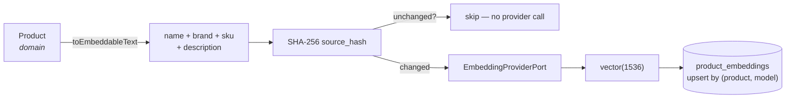

# AI architecture

Decision: [ADR-007](../adr/ADR-007-openai-provider-adapter.md).

## Three ports, not one

| Port                             | Signature                                   | Used by                               |
| -------------------------------- | ------------------------------------------- | ------------------------------------- |
| `EmbeddingProviderPort`          | `embed(texts[]) → EmbeddingResult[]`        | Semantic search indexing and querying |
| `TextGenerationProviderPort`     | `generate({instruction, input}) → text`     | B2C descriptions from technical data  |
| `DocumentExtractionProviderPort` | `extract({bytes, mimeType}) → attributes[]` | Attributes from supplier PDFs         |

They are separate because their consumers, failure modes and cost profiles differ — and
because a future provider may be the best choice for one and not the others.

## Configuration, never code

```bash
AI_PROVIDER=openai              # or `fake`
AI_GENERATION_MODEL=gpt-4o-mini
AI_EMBEDDING_MODEL=text-embedding-3-small
AI_EMBEDDING_DIMENSIONS=1536    # MUST equal the vector(N) column width
OPENAI_API_KEY=...              # required only when AI_PROVIDER=openai
```

No model name appears in application code. `import OpenAI` appears in exactly one folder
(`modules/ai/infrastructure/openai/`), and the architecture test fails the build if it
appears anywhere else.

`AI_PROVIDER` defaults to `fake`, so a new developer and CI both get a working system with
no key and no spend.

## Indexing pipeline



`Product.toEmbeddableText()` lives in the **domain**, because deciding what represents a
product semantically is a business judgement, not an infrastructure detail.

## Cost control

The `source_hash` short-circuit is the whole strategy, and it is not incidental: re-indexing
45,000 products costs the provider price of the products whose text actually changed, not of
45,000 embeddings. `IndexProductUseCase` compares the hash of the text it is about to embed
against the stored one and returns `{ indexed: false, reason: 'unchanged' }` when they match.
`force: true` overrides it, for a deliberate model migration.

Additional levers, in the order they should be reached for:

1. Batch through `embed(texts[])` — the port is batched precisely for this.
2. Run bulk indexing as `AI_EMBEDDING` jobs so it is rate-limited by worker concurrency
   rather than by whoever clicked the button.
3. Truncate embedded text to a sensible cap — long inherited descriptions are mostly noise.

## Model versioning and re-embedding

`product_embeddings` holds one row per **(product, model)**. That single choice is what makes
a model change safe:

1. Deploy with the new `AI_EMBEDDING_MODEL`. Nothing breaks: search still queries the old
   model, because `searchSimilar` filters by model, and vectors from different models are
   not comparable.
2. Back-fill by enqueuing `AI_EMBEDDING` jobs with `force: true`. Old and new vectors coexist.
3. When coverage is complete, queries move to the new model automatically — they already use
   whatever the configured provider reports.
4. Delete the old model's rows once nothing queries it.

**Changing `AI_EMBEDDING_DIMENSIONS` is different and more expensive**: the column is
`vector(1536)`, so a new width needs a new migration (and, realistically, a new table), plus
a full re-embed. An integration test asserts the configured dimensionality matches the
column, so the mismatch is caught in CI rather than at 3am.

## Testing without a provider

`FakeEmbeddingAdapter` is not a stub returning zeroes. It hashes token trigrams into a
fixed-width bag-of-features and L2-normalises the result, so overlapping strings genuinely
land closer together under cosine similarity — enough to assert that a search for
"rodamiento de bolas sellado" ranks the bearing above the motor oil. Unit tests assert that
property directly; the integration suite runs the same fake against real pgvector.

Consequence: the full suite is deterministic, offline and free. No test has ever called
OpenAI, and none should.

## Human review is part of the design

`ProductAttribute` carries `source` (`manual | erp | import | document_extraction |
ai_generated`) and `confidence`, and `requiresHumanReview()` encodes the rule that
low-confidence machine-derived values must not reach a sales channel unchecked. The
threshold is a placeholder until Casa del Rulimán sets it — but the _shape_ is fixed now,
because retrofitting provenance onto attribute data later is painful.

## Not built yet

- **Token accounting and budget guards.** `GenerationResult` carries token counts; nothing
  aggregates them. This must exist before any bulk generation runs against a real key.
- **Prompt versioning.** Prompts are inline constants. When generation becomes a real
  feature, they need to be versioned and stored with their output.
- **Relevance evaluation.** The fake proves the plumbing, not the search quality.
