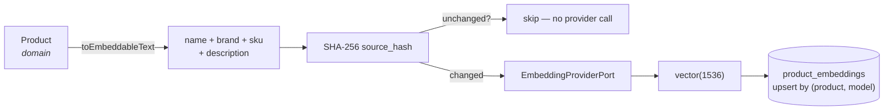

# AI architecture

Decision: [ADR-007](../adr/ADR-007-openai-provider-adapter.md).

## Three ports, not one

| Port                             | Signature                                   | Used by                               |
| -------------------------------- | ------------------------------------------- | ------------------------------------- |
| `EmbeddingProviderPort`          | `embed(texts[]) → EmbeddingResult[]`        | Semantic search indexing and querying |
| `TextGenerationProviderPort`     | `generate({instruction, input}) → text`     | B2C descriptions from technical data  |
| `DocumentExtractionProviderPort` | `extract({bytes, mimeType}) → attributes[]` | Attributes from supplier PDFs         |

They are separate because their consumers, failure modes and cost profiles differ — and
because a future provider may be the best choice for one and not the others.

## Configuration, never code

```bash
AI_EMBEDDING_PROVIDER=openai              # each capability defaults to `fake`
AI_GENERATION_PROVIDER=openai
AI_DOCUMENT_EXTRACTION_PROVIDER=openai
AI_GENERATION_MODEL=gpt-6-luna
AI_DOCUMENT_EXTRACTION_MODEL=gpt-6-luna
AI_EMBEDDING_MODEL=text-embedding-3-small
AI_EMBEDDING_DIMENSIONS=1536    # MUST equal the vector(N) column width
AI_DOCUMENT_MAX_BYTES=5242880   # stricter than the general 20 MB asset limit
OPENAI_TIMEOUT_MS=25000         # below the 45s browser BFF deadline
OPENAI_MAX_RETRIES=0
OPENAI_API_KEY=...              # required when any capability selects OpenAI
```

No model name appears in application code. `import OpenAI` appears in exactly one folder
(`modules/ai/infrastructure/openai/`), and the architecture test fails the build if it
appears anywhere else.

Every capability defaults to `fake`, so a new developer and CI both get a working system with
no key and no spend. `AI_PROVIDER` remains a deprecated compatibility alias for embeddings
only. This is intentionally fail-closed: an operator who enables semantic embeddings does not
implicitly authorize commercial catalogue text or private supplier documents to leave the system.

The production recommendation is `gpt-6-luna` for focused extraction and catalogue copy,
using low reasoning effort through the Responses API, and `text-embedding-3-small` with its
native 1536 dimensions for semantic search. The names remain configurable so a deployment can
pin another model after an evaluation without changing application code.

The configured generation model must support the Responses API and Structured Outputs because
document extraction uses `input_file`/`input_image` plus a strict JSON schema. The adapter applies
low reasoning effort to GPT-5/6 and o-series models, and deterministic temperature control to
classic models. For embeddings, the optional `dimensions` parameter is sent only to the
`text-embedding-3-*` family; every response is still checked against
`AI_EMBEDDING_DIMENSIONS` before it can reach PostgreSQL.

## Secret handling

`OPENAI_API_KEY` has no default and is never accepted from an HTTP request or stored in the
database. For local development it belongs only in the ignored root `.env`; QAS/PRD inject it
from AWS Secrets Manager. A key exposed in chat, a ticket or source control must be revoked and
replaced before enabling any OpenAI capability.

## Safe candidate endpoints

Two authenticated API operations expose the provider without letting a model mutate the PIM:

| Route                                              | Capability                             | Result                                          |
| -------------------------------------------------- | -------------------------------------- | ----------------------------------------------- |
| `POST /api/v1/ai/products/:id/commercial-proposal` | `catalog:read` + `ai-quality:execute`  | Commercial-copy candidate for human review      |
| `POST /api/v1/ai/assets/:id/extraction-candidates` | `catalog:read` + `ai-document:extract` | Attribute candidates from an existing PDF/image |

Both use the `ai` rate-limit profile. Responses always carry `persisted: false` and
`requiresHumanReview: true`; accepting a candidate remains a separate, explicit catalogue action.
The commercial proposal receives only the product core plus non-empty dynamic attributes already
visible to the authenticated actor. The extraction route intersects the requested keys with the
active template attributes that are visible and editable for that actor; an empty request means
"all eligible keys", never unrestricted extraction. It rejects unsupported MIME types and
oversized metadata before downloading, then verifies the stored byte length, SHA-256 and file
signature before calling a provider. It accepts PDF/JPEG/PNG/WebP, caps output at 200 candidates,
never returns the raw model transcript, and does not support DWG input.

Successful generation and extraction calls append audit entries with actor, provider model,
token counts when available, bounded counts and `persisted: false`. Prompts, document bytes,
candidate values and generated copy are deliberately excluded from audit storage.

## Indexing pipeline



`Product.toEmbeddableText()` lives in the **domain**, because deciding what represents a
product semantically is a business judgement, not an infrastructure detail.

## Cost control

The `source_hash` short-circuit is the whole strategy, and it is not incidental: re-indexing
45,000 products costs the provider price of the products whose text actually changed, not of
45,000 embeddings. `IndexProductUseCase` compares the hash of the text it is about to embed
against the stored one and returns `{ indexed: false, reason: 'unchanged' }` when they match.
`force: true` overrides it, for a deliberate model migration.

Additional levers, in the order they should be reached for:

1. Batch through `embed(texts[])` — the port is batched precisely for this.
2. Run bulk indexing as `AI_EMBEDDING` jobs so it is rate-limited by worker concurrency
   rather than by whoever clicked the button.
3. Truncate embedded text to a sensible cap — long inherited descriptions are mostly noise.

## Model versioning and re-embedding

`product_embeddings` holds one row per **(product, model)**. That single choice is what makes
a model change safe:

1. Deploy with the new `AI_EMBEDDING_MODEL`. Nothing breaks: search still queries the old
   model, because `searchSimilar` filters by model, and vectors from different models are
   not comparable.
2. Back-fill by enqueuing `AI_EMBEDDING` jobs with `force: true`. Old and new vectors coexist.
3. When coverage is complete, queries move to the new model automatically — they already use
   whatever the configured provider reports.
4. Delete the old model's rows once nothing queries it.

**Changing `AI_EMBEDDING_DIMENSIONS` is different and more expensive**: the column is
`vector(1536)`, so a new width needs a new migration (and, realistically, a new table), plus
a full re-embed. An integration test asserts the configured dimensionality matches the
column, so the mismatch is caught in CI rather than at 3am.

## Testing without a provider

`FakeEmbeddingAdapter` is not a stub returning zeroes. It hashes token trigrams into a
fixed-width bag-of-features and L2-normalises the result, so overlapping strings genuinely
land closer together under cosine similarity — enough to assert that a search for
"rodamiento de bolas sellado" ranks the bearing above the motor oil. Unit tests assert that
property directly; the integration suite runs the same fake against real pgvector.

Consequence: the full suite is deterministic, offline and free. No test has ever called
OpenAI, and none should.

## Human review is part of the design

`ProductAttribute` carries `source` (`manual | erp | import | document_extraction |
ai_generated`) and `confidence`, and `requiresHumanReview()` encodes the rule that
low-confidence machine-derived values must not reach a sales channel unchecked. The
threshold is a placeholder until Casa del Rulimán sets it — but the _shape_ is fixed now,
because retrofitting provenance onto attribute data later is painful.

## Not built yet

- **Budget aggregation and guards.** Per-request usage is audited when the provider reports it,
  but nothing aggregates spend or enforces tenant budgets. This must exist before bulk generation.
- **End-to-end client disconnect cancellation.** Provider timeouts finish before the BFF deadline,
  but the Nest/Express request abort signal is not yet threaded through every AI port. Rate limits,
  byte limits and zero default retries bound the residual work.
- **Prompt versioning.** Prompts are inline constants. When generation becomes a real
  feature, they need to be versioned and stored with their output.
- **Relevance evaluation.** The fake proves the plumbing, not the search quality.
