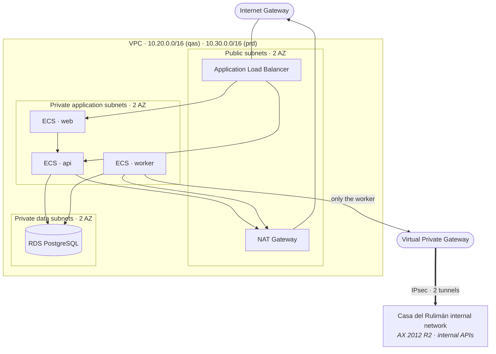

# AWS architecture

Decisions: [ADR-004](../adr/ADR-004-aws-ecs-fargate.md) (ECS Fargate),
[ADR-008](../adr/ADR-008-site-to-site-vpn.md) (Site-to-Site VPN),
[ADR-010](../adr/ADR-010-iac-terraform.md) (Terraform). The code lives in
`cdr-pim-infrastructure`.

> **Nothing in this document has been applied to a real AWS account.** No credentials were
> provided and none were invented. The Terraform is written, formatted and validated;
> `terraform plan` requires an account and the values Casa del Rulimán still has to supply.

## Network topology (per environment)

**Three subnet tiers, and the reason for each:**

| Tier                | Contains         | Inbound                                               | Outbound                                         |
| ------------------- | ---------------- | ----------------------------------------------------- | ------------------------------------------------ |
| Public              | ALB, NAT gateway | 443 from the internet                                 | Internet                                         |
| Private application | ECS tasks        | Only from the ALB security group                      | NAT (internet) and, for the worker only, the VPN |
| Private data        | RDS              | Only 5432, and only from the ECS task security groups | None                                             |

RDS has **no route to the internet at all**. Not "blocked by a security group" — no route.

## Environment separation

QAS and PRD are entirely separate: separate VPCs, RDS instances, S3 buckets, SQS queues,
secrets, ECS clusters, security groups and Terraform state files. Nothing is shared.

|                     | QAS                       | PRD                                                 |
| ------------------- | ------------------------- | --------------------------------------------------- |
| RDS                 | Single-AZ, `db.t4g.small` | **Multi-AZ**, `db.t4g.medium`+, deletion protection |
| Backup retention    | 7 days                    | 30 days, point-in-time recovery                     |
| ECS tasks (api)     | 1                         | ≥2 across AZs                                       |
| Log retention       | 30 days                   | 90 days                                             |
| Deletion protection | off                       | **on**, everywhere it exists                        |

Naming is systematic — `cdr-pim-qas-*` and `cdr-pim-prd-*` — so IAM policies, cost
allocation and CloudWatch queries can be scoped by prefix, and so nobody misreads which
environment a console page is showing.

## Terraform modules

| Module        | Provisions                                                                 |
| ------------- | -------------------------------------------------------------------------- |
| `network`     | VPC, subnets, route tables, IGW, NAT, flow logs                            |
| `vpn`         | Customer gateway, VPN gateway, connection, routes                          |
| `security`    | Security groups, the ALB→ECS→RDS chain                                     |
| `ecr`         | Repositories with immutable tags, lifecycle policy, image scanning         |
| `rds`         | PostgreSQL, subnet group, parameter group, encryption, backups             |
| `s3`          | Private buckets: versioning, encryption, public access block, lifecycle    |
| `sqs`         | Job queue, DLQ, redrive policy, encryption                                 |
| `eventbridge` | Scheduler rules that enqueue jobs                                          |
| `secrets`     | Secrets Manager entries and access policies (**values are never in code**) |
| `ecs`         | Cluster, task definitions, services, task and execution IAM roles          |
| `alb`         | Load balancer, listeners, ACM certificate, target groups                   |
| `monitoring`  | Log groups, metric filters, alarms, SNS topic                              |

## The VPN, concretely

Routing is **specific, not default**: only the CDR CIDR blocks route to the virtual private
gateway. Internet-bound traffic (ECR, OpenAI) keeps using the NAT gateway. Only the worker's
security group is granted egress over the tunnel, and only to the specific internal hosts and
ports the integration needs.

**What Casa del Rulimán must provide before this can be planned or applied** — these are
declared as Terraform variables with no defaults, and are deliberately not guessed:

1. Public IP of the VPN gateway/firewall
2. Device vendor, model and software version (AWS emits a matching configuration file)
3. Internal CIDR blocks that must be reachable from AWS
4. BGP ASN, or confirmation that static routing is preferred
5. Host/IP and port of AX and of any internal API
6. Internal DNS servers, if hostnames rather than IPs are used
7. Confirmation that CDR's firewall permits the VPC CIDR inbound
8. A change window and a technical contact for tunnel bring-up

## Cost shape

The recurring floor is the NAT gateway, the ALB, the VPN connection and RDS — roughly
US$150–250/month per environment at the sizes above, before data transfer and OpenAI usage.
The largest avoidable line is NAT data processing; VPC endpoints for ECR, S3 and Secrets
Manager would remove most of it and are the first optimisation to consider, once there is a
bill to look at.
