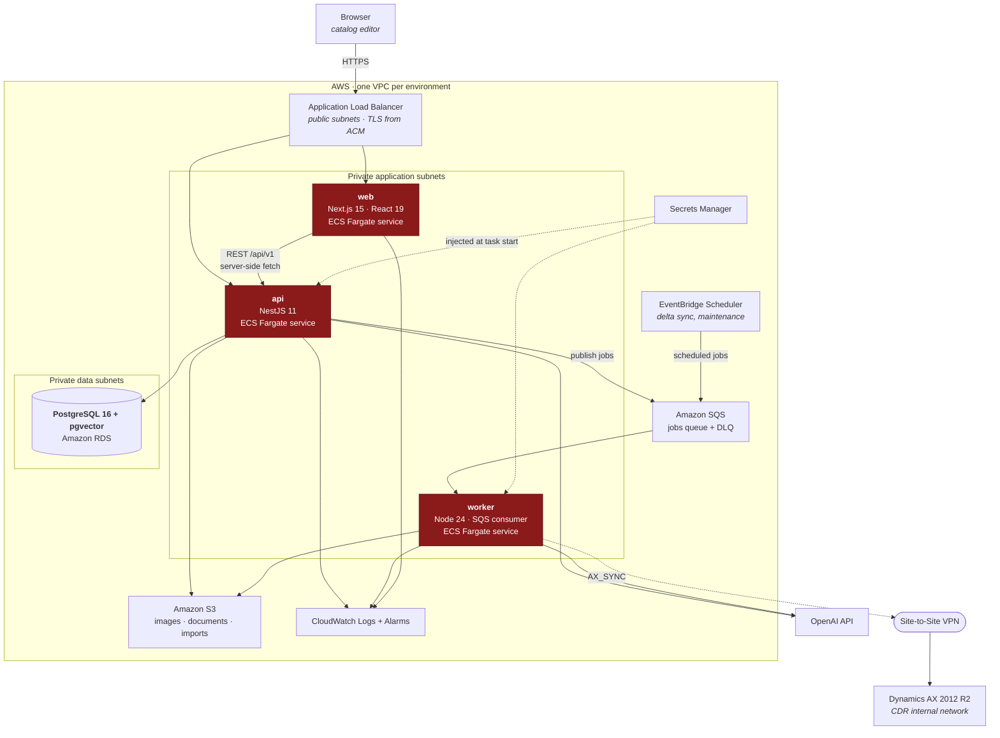

# C4 Level 2 — Containers

## Containers

| Container                 | Technology                                   | Responsibility                                                                      | Scales on                         |
| ------------------------- | -------------------------------------------- | ----------------------------------------------------------------------------------- | --------------------------------- |
| **web**                   | Next.js 15, React 19, Tailwind v4, shadcn/ui | Server-rendered UI. Talks only to the API — never to the database                   | Request volume                    |
| **api**                   | NestJS 11, TypeScript                        | HTTP surface, business rules, all database access, job publication                  | Request volume                    |
| **worker**                | Node 24, TypeScript                          | SQS consumer: AX sync, embeddings, document extraction, imports, channel publishing | Queue depth                       |
| **PostgreSQL**            | RDS PostgreSQL 16 + pgvector                 | Every persistent record, including embeddings                                       | Vertical; read replicas if needed |
| **SQS**                   | Standard queue + DLQ                         | Work distribution and retry                                                         | Managed                           |
| **S3**                    | Private, versioned, encrypted                | Binary assets; the database stores only metadata                                    | Managed                           |
| **EventBridge Scheduler** | —                                            | Cron triggers that enqueue jobs                                                     | Managed                           |

## Communication rules

1. **The browser never calls the API directly for data it can get server-side.** Rendering
   happens in server components using the internal base URL, so the API does not have to be
   publicly reachable for the page to render.
2. **The web container has no database credentials.** It cannot query PostgreSQL even by
   mistake.
3. **The worker has no HTTP surface** beyond `/health/live` and `/health/ready`. It is not
   behind the load balancer and has no target group.
4. **The API never performs long work inline.** Anything slow or bursty becomes a job.
5. **Only the worker gets VPN egress.** The API's security group cannot reach the CDR network.

## Why three containers rather than one

The web and API split lets the UI be rendered and cached independently of business logic,
and keeps database credentials out of the browser-facing process.

The worker split is the one that matters most: embedding 45k products or synchronising AX
has a completely different resource profile and failure mode from serving an editor's page.
Sharing a process would mean a stuck import degrades the UI, and scaling for a nightly batch
would mean over-provisioning the API all day.
