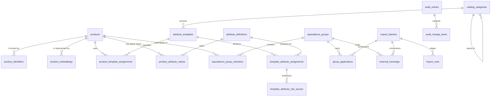

# Data architecture

Decisiones: [ADR-005](../adr/ADR-005-postgresql-pgvector.md) (PostgreSQL + pgvector),
[ADR-009](../adr/ADR-009-database-access-library.md) (Drizzle + migraciones SQL),
[ADR-011](../adr/ADR-011-unified-code-inheritance-and-homolog-search.md) y
[ADR-012](../adr/ADR-012-template-driven-product-data.md).

## Esquema actual



### Núcleo de producto

- `products`: identidad comercial básica y estado del SKU.
- `product_identifiers`: códigos externos como filas, únicos por `(type, value)`.
- `product_embeddings`: un vector por producto/modelo con `vector(1536)` e índice HNSW.
- `equivalence_groups` y `equivalence_group_members`: código unificador como agregado N:N.

### Categorías, plantillas y atributos

- `catalog_categories`: taxonomía PIM con ruta materializada y desactivación lógica.
- `attribute_templates`: versiones por categoría; como máximo una activa por categoría.
- `attribute_definitions`: clave estable, tipo, unidad, valores permitidos, vigencia y
  autoridad (`pim`, `erp`, `supplier`, `calculated`).
- `template_attribute_assignments`: orden, obligatoriedad, replicabilidad, búsqueda,
  activación e inclusión en la futura ficha técnica. Desactivar no elimina valores.
- `template_attribute_role_access`: permisos por `ADMINISTRADOR`, `COMPRAS` y `VENTAS` para
  ver, editar, importar y exportar cada atributo.
- `product_template_assignments`: plantilla que tipa al producto.
- `product_attribute_values`: una columna física por familia de tipo (`text`, `numeric`,
  `boolean`, `date`, `jsonb`), versión optimista, procedencia, confianza y vigencia.

El grid no materializa una tabla distinta por categoría. Lee la plantilla activa y construye
las columnas permitidas para el actor. Los filtros solo pueden usar atributos visibles y
marcados como buscables. El endpoint humano modifica únicamente atributos con autoridad
`pim`; fuentes externas se reservan para sus flujos de integración/importación.

Cuando una asignación es `replicable`, la misma transacción actualiza los productos
elegibles del código unificador y registra una entrada de auditoría por producto. La
concurrencia del producto solicitado usa `version`; la administración de categorías y
asignaciones usa `updated_at` como token optimista.

### Aplicaciones y homólogos

- `group_applications`: aplicaciones automotrices/industriales del grupo, con desactivación
  lógica y procedencia manual/importación.
- `external_homologs`: códigos externos asociados al grupo. Solo `active=true` y
  `approval_status='approved'` participan en la búsqueda pública de homólogos.

La pertenencia al grupo, y no el SKU individual, es la fuente de herencia para aplicaciones.

### Importaciones

`import_batches` e `import_rows` implementan staging durable para CSV/JSON:

1. parsear y validar por fila;
2. guardar preview e idempotency key;
3. consultar errores y totales;
4. confirmar únicamente lotes sin errores.

Confirmar cambia el estado y conserva el contenido, pero todavía **no aplica** las filas a
atributos, aplicaciones ni homólogos. Esa aplicación debe invocar los casos de uso de cada
contexto para conservar validación, herencia y auditoría; nunca escribir directamente en
sus tablas.

### Auditoría

`audit_entries` es el sobre append-only y `audit_change_items` materializa una fila por
campo con valor anterior, posterior y vigencia previa. Triggers impiden
`UPDATE`, `DELETE` y `TRUNCATE`.

Las ediciones de atributos dinámicos y la administración de plantilla usan una unidad de
trabajo PostgreSQL: dato y auditoría confirman o revierten juntos. Para que el historial se
pueda buscar por SKU/campo, un atributo se registra como:

- `resource_type = 'product'`;
- `resource_id = product_id`;
- `field_name = attribute key`;
- `source = 'manual'` para edición humana.

El patrón y las escrituras antiguas pendientes de migración están en
[`AUDIT_UNIT_OF_WORK.md`](./AUDIT_UNIT_OF_WORK.md).

## Convenciones

| Tema            | Convención                                                                                                  |
| --------------- | ----------------------------------------------------------------------------------------------------------- |
| Identificadores | UUID generados por la aplicación; el seed usa UUID v5 deterministas                                         |
| Nombres         | `snake_case` en PostgreSQL, `camelCase` en TypeScript                                                       |
| Tiempo          | `timestamptz` en UTC; localización solo en presentación                                                     |
| Enumeraciones   | `text` + `CHECK`, no tipos `ENUM` de PostgreSQL                                                             |
| Borrado         | Cascada para datos estrictamente dependientes; desactivación lógica para información que conserva historial |
| Binarios        | PostgreSQL conserva metadatos en `product_assets`; los bytes viven en el storage privado configurado        |

## Migraciones y Drizzle

Las migraciones SQL en `apps/api/drizzle/` son autoritativas y siguen
`NNNN_snake_case_name.sql`. Cada archivo corre en su propia transacción, su SHA-256 queda
registrado y un advisory lock evita carreras entre despliegues.

```bash
pnpm db:new add_feature
pnpm db:migrate
```

Una migración aplicada nunca se modifica: cualquier cambio posterior requiere otro número.
Las definiciones Drizzle son la superficie tipada; `schema-drift.spec.ts` compara sus
columnas con `information_schema` sobre una base recién migrada.

## pgvector

`product_embeddings` conserva una fila por `(product_id, model)`, dimensión fija 1536,
distancia coseno e índice HNSW. Cambiar modelo o dimensión exige nueva migración y
reindexación completa. Con unos 45 000 productos el índice es preventivo, no una necesidad
de capacidad actual.

## Backup y activos

La estrategia objetivo continúa siendo RDS con recuperación a un instante y restauración a
una instancia nueva. `product_assets` conserva metadatos, historial de reemplazos y borrado
lógico; el binario se guarda mediante `@cdr/storage` en memoria para desarrollo o en un bucket
S3 privado y cifrado según la configuración. La API autenticada limita tamaño y formato,
verifica firma/MIME/extensión y protege los ZIP contra rutas inseguras y expansión anómala.
El escaneo antimalware y la política de ciclo de vida del bucket siguen siendo responsabilidades
pendientes de plataforma.
