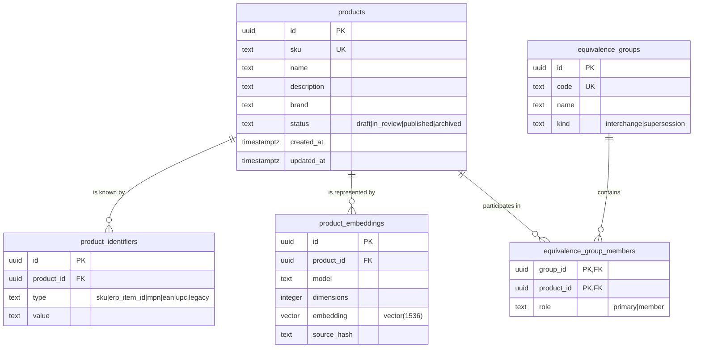

# Data architecture

Decisions: [ADR-005](../adr/ADR-005-postgresql-pgvector.md) (PostgreSQL + pgvector),
[ADR-009](../adr/ADR-009-database-access-library.md) (Drizzle + hand-written migrations).

## Current schema



Five tables, on purpose. Categories, attributes, images, documents and data quality are
**not** created yet: their shape depends on functional decisions Casa del Rulimán has not
made, and a speculative table is a migration you will have to write twice.

## Conventions

| Concern      | Convention                                                                                                                             |
| ------------ | -------------------------------------------------------------------------------------------------------------------------------------- |
| Identifiers  | UUID v4, generated by the **application**, so an aggregate can be fully built (and referenced in a job) before the transaction commits |
| Naming       | `snake_case` in the database, `camelCase` in TypeScript; Drizzle maps between them                                                     |
| Time         | `timestamptz`, always UTC. Localisation to America/Guayaquil happens at the presentation edge only                                     |
| Enumerations | `text` + `CHECK`, not PostgreSQL `ENUM` — adding a value is a one-line migration instead of a non-transactional `ALTER TYPE`           |
| Deletion     | `ON DELETE CASCADE` from `products` to everything that describes a product                                                             |
| Binaries     | Never in the database. S3 holds bytes; PostgreSQL holds bucket, key, mime type, size, checksum and version                             |

## Two modelling decisions worth defending

**Identifiers are rows, not columns.** A product carries a SKU, an AX item number, a
manufacturer part number, EAN/UPC and any number of legacy codes inherited from
spreadsheets. As columns this becomes a widening table with an unindexable "find by any
code" query. As rows it is one table with a unique index on `(type, value)` — and "which
product is this code?" is a single indexed lookup.

**An equivalence group is its own aggregate.** A `codigo_unificador` column on `products`
can express neither "one group holds N interchangeable products" nor "this product is in the
6205 interchange family _and_ supersedes a discontinued part". The join table expresses
both, carries the group's own attributes (`kind`, `name`), and enforces "at most one primary
per group" with a partial unique index. Both directions are covered by integration tests.

## Migrations

Migrations are hand-written SQL in `apps/api/drizzle/`, named `NNNN_snake_case_name.sql`,
applied by `apps/api/src/database/migrator.ts`.

```bash
pnpm db:new add_product_attributes   # scaffolds the next numbered file
# ... write the SQL, including a comment explaining WHY and the reverse where sensible
pnpm db:migrate                      # applies pending migrations
```

Two properties are enforced by the runner, not by convention:

1. **Immutability.** Every applied migration's SHA-256 is recorded and re-verified on each
   run. Editing a file that has already run _anywhere_ is a hard error — this is what stops
   QAS and PRD from silently diverging. To change something, write a new migration.
2. **Advisory locking.** `pg_advisory_lock` means concurrently starting ECS tasks cannot
   race the same DDL.

Each migration runs in its own transaction and is recorded in `cdr_schema_migrations`.

### Keeping Drizzle and SQL in step

The SQL is authoritative; the Drizzle table definitions are a typed query surface over it.
Nothing in the toolchain forces them to agree, so
`apps/api/test/integration/schema-drift.spec.ts` compares every declared column against
`information_schema` on a freshly migrated database. **If it fails after you wrote a
migration, update the `*.tables.ts` file — never the other way round.**

## pgvector

```sql
CREATE TABLE product_embeddings (
  ...
  embedding    vector(1536) NOT NULL,
  source_hash  text         NOT NULL,
  CONSTRAINT product_embeddings_dimensions_supported CHECK (dimensions = 1536)
);

CREATE UNIQUE INDEX product_embeddings_product_model_key
  ON product_embeddings (product_id, model);

CREATE INDEX product_embeddings_hnsw_cosine_idx
  ON product_embeddings USING hnsw (embedding vector_cosine_ops)
  WITH (m = 16, ef_construction = 64);
```

- **One row per (product, model).** A model migration back-fills new vectors alongside the
  old ones and switches over only when coverage is complete.
- **Cosine distance (`<=>`)**, matching the index's operator class. Using any other operator
  silently falls back to a sequential scan.
- **HNSW over IVFFlat**: no training step, and recall does not degrade as the worker inserts
  vectors one at a time.
- `m = 16` / `ef_construction = 64` are pgvector's defaults, written out explicitly so a
  future tuning change is a visible diff.
- **The width is fixed at 1536.** `AI_EMBEDDING_DIMENSIONS` must match it; changing it is a
  new migration plus a full re-embedding, and an integration test asserts the two agree.

### At this scale, honestly

45,000 vectors is small. A sequential scan would be perfectly usable. The index is created
now because it is cheap on an empty table, whereas building it later on a populated one needs
`CONCURRENTLY` and a maintenance window. It is not there because the volume demands it.

## Backup and recovery

RDS automated backups with point-in-time recovery: 7 days in QAS, 30 in PRD. PRD has
deletion protection and Multi-AZ. Restores are to a **new instance** — never in place — and
the restore procedure belongs in the infrastructure repository's runbook.

S3 buckets are versioned, so an overwritten or deleted asset is recoverable independently.
