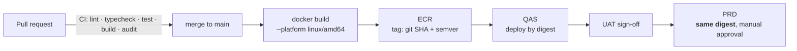

# Deployment strategy

## Branching

Deliberately simple. GitFlow's release and hotfix branches solve a problem this team does
not have.

```
main ──────────────────────────────────────────────►  always deployable
  ▲            ▲                ▲
  │            │                │
feature/…   fix/…            chore/…      short-lived, squash-merged via PR
```

- `main` is protected: pull request, green CI, one approval.
- Environments are **not** branches. QAS and PRD are the same commit at different stages of
  promotion. A `dev`/`qas`/`main` branch triple would guarantee drift between them and add
  merge work that buys nothing.
- Releases are tagged `v0.1.0` on `main`.
- Commit messages follow Conventional Commits (`feat:`, `fix:`, `chore:`, `docs:`, `ci:`).

## Build once, promote the same artefact

The principle that makes "it worked in QAS" mean something:



**The image is never rebuilt for PRD.** Promotion updates the PRD ECS service to the digest
already validated in QAS. Rebuilding would produce a different artefact — different base
image patches, different transitive dependencies — and silently invalidate the testing.

Tagging: `<git-sha>` always, plus `v<semver>` on a release tag. Never `latest` for a
deployment; ECR repositories use immutable tags so a tag cannot be moved under a running
service.

### The one exception: `web`

`NEXT_PUBLIC_*` variables are inlined into the client bundle at **build** time. Since QAS
and PRD have different public API URLs, the web image is built once per environment with the
appropriate `--build-arg`. The `api` and `worker` images follow strict build-once-promote.

This is a real asymmetry, called out here so nobody assumes otherwise. It could be removed
by serving public configuration from a runtime endpoint — worth doing if environment count
grows.

### Architecture footgun

Developer machines here are **arm64**; Fargate tasks are configured for **amd64**. CI must
build with `--platform linux/amd64`. An image built locally on an Apple Silicon machine and
pushed by hand will fail to start in ECS with an exec-format error that reads like a
corrupted image.

## Pipelines

| Workflow                | Trigger                      | Does                                                                                                                                                                            |
| ----------------------- | ---------------------------- | ------------------------------------------------------------------------------------------------------------------------------------------------------------------------------- |
| `ci.yml`                | PR, push to `main`           | install → format:check → lint → typecheck → unit + architecture tests → integration tests (PostgreSQL service container) → build → `pnpm audit` → gitleaks → Docker build check |
| `build-and-publish.yml` | push to `main`, release tag  | Builds `linux/amd64` images, pushes to ECR tagged with the git SHA, records the digest                                                                                          |
| `promote.yml`           | manual (`workflow_dispatch`) | Deploys an existing digest to QAS or PRD. **PRD requires a GitHub Environment approval**                                                                                        |

`build-and-publish.yml` and `promote.yml` authenticate to AWS via **OIDC** — no long-lived
access keys in GitHub secrets.

## Database migrations

Migrations run as a **one-off ECS task from the same image**, _before_ the service is
updated:

```
1. push image to ECR
2. run migration task   (node dist/database/migrate.cli.js)
3. update the ECS service to the new task definition
4. ECS rolling deployment with the circuit breaker enabled
```

Never from inside a serving container: two starting tasks would race. (The advisory lock in
the runner makes that survivable, but "survivable" is not a design.)

Because migrations run before the new code, **every migration must be backward compatible
with the currently running version.** Adding a NOT NULL column without a default breaks the
old code mid-deployment. The safe pattern is expand → migrate → contract, over two releases:

1. add the column as nullable, deploy code that writes it;
2. back-fill;
3. in a later release, add the constraint and remove the old path.

## Rollback

| Situation                           | Action                                                                                                  |
| ----------------------------------- | ------------------------------------------------------------------------------------------------------- |
| Bad code, schema unchanged          | Update the ECS service to the previous digest. Minutes                                                  |
| Bad code, additive schema change    | Same. Additive migrations are backward compatible by construction                                       |
| Bad code, destructive schema change | Roll **forward** with a corrective migration. This is why destructive changes are split across releases |
| Failed deployment                   | ECS deployment circuit breaker rolls back automatically when the new tasks fail their health checks     |

## Environment promotion checklist

Before QAS → PRD:

- [ ] The digest has been running in QAS and UAT is signed off
- [ ] Any migration has been applied to QAS and is backward compatible
- [ ] New environment variables and secrets exist in PRD's Secrets Manager
- [ ] Terraform changes (if any) are applied to PRD **first** — infrastructure leads the
      application, never trails it
- [ ] Alarms and dashboards cover anything new
- [ ] A rollback digest is identified

## Infrastructure deployment

Separate repository, separate cadence, separate credentials.

```bash
cd environments/qas
terraform init && terraform plan -out=tfplan   # reviewed in the PR
terraform apply tfplan
```

PRD `apply` is never automatic. When a change spans both repositories (a new SQS queue, for
example), the order is always: Terraform first, then application configuration, then
application deploy.
