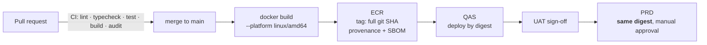

# Deployment strategy

## Branching

Deliberately simple. GitFlow's release and hotfix branches solve a problem this team does
not have.

```
main ──────────────────────────────────────────────►  always deployable
  ▲            ▲                ▲
  │            │                │
feature/…   fix/…            chore/…      short-lived, squash-merged via PR
```

- Repository administration must protect `main`: pull request, green CI, and at least one
  approval. This is a release prerequisite, not a setting created by the workflow.
- Environments are **not** branches. QAS and PRD are the same commit at different stages of
  promotion. A `dev`/`qas`/`main` branch triple would guarantee drift between them and add
  merge work that buys nothing.
- Releases are tagged `v0.1.0` on `main`.
- Commit messages follow Conventional Commits (`feat:`, `fix:`, `chore:`, `docs:`, `ci:`).

## Build once, promote the same artefact

The principle that makes "it worked in QAS" mean something:



**The image is never rebuilt for PRD.** Promotion resolves the requested tag to an
immutable **ECR digest**, registers a new ECS task definition revision pointing at that
digest, and updates the service to it. Rebuilding would produce a different artefact —
different base image patches, different transitive dependencies — and silently invalidate
the testing.

Mechanically (`promote.yml`), per application:

1. accept only a complete, lowercase 40-character git commit SHA;
2. `ecr describe-images` → `imageDigest`;
3. `ecs describe-task-definition` on the revision currently in use, so CPU, memory,
   environment, secrets and IAM roles are carried over untouched;
4. replace only `containerDefinitions[0].image` with `<repo>@<digest>`;
5. `register-task-definition` → new revision;
6. `update-service --task-definition <new revision>`;
7. after `services-stable`, read back the running image and assert it equals the promoted
   digest.

Step 7 is what makes `IMAGE_QAS == IMAGE_PRD` verifiable rather than assumed: promote the
same tag to both environments and the assertion prints the same digest in each run.

Tagging: `<full-git-sha>` always. A strictly validated `v<semver>` release event may add an
alias only after proving the tagged commit belongs to `main`; it reuses the existing OCI
index without rebuilding, preserving its provenance and SBOM. **`latest` is never published
at all**, and promotion never accepts the SemVer alias.

Terraform's `image_tag` variable is therefore required and has no default: it sets only the
first task definition. Every deployment after that is a revision registered by the promote
workflow, which is why the services declare `ignore_changes = [task_definition]`.

### All three images are promotable

There is no exception. The web image is environment-agnostic because every API call is made
server-side by `createServerApiClient()`, which reads `API_BASE_URL` at **runtime**. No
`NEXT_PUBLIC_*` value carrying an environment-specific URL is baked into the bundle.

Keep it that way. `NEXT_PUBLIC_*` is inlined at build time, so introducing
`NEXT_PUBLIC_API_BASE_URL` would bake QAS into the artefact and make it unpromotable. If a
browser-side component needs the API, proxy it through a Next route handler.

### Architecture footgun

Developer machines here are **arm64**; Fargate tasks are configured for **amd64**. CI must
build with `--platform linux/amd64`. An image built locally on an Apple Silicon machine and
pushed by hand will fail to start in ECS with an exec-format error that reads like a
corrupted image.

## Pipelines

| Workflow                | Trigger                      | Does                                                                                                                                                                                   |
| ----------------------- | ---------------------------- | -------------------------------------------------------------------------------------------------------------------------------------------------------------------------------------- |
| `ci.yml`                | PR, push to `main`           | install → format:check → lint → typecheck → unit + architecture tests → integration tests (PostgreSQL service container) → build → `pnpm audit` → gitleaks → Docker build check        |
| `build-and-publish.yml` | push to `main`, release tag  | Builds `linux/amd64` once per main commit with provenance/SBOM; a validated release tag only aliases the existing OCI index                                                            |
| `promote.yml`           | manual (`workflow_dispatch`) | Validates a full commit SHA before OIDC, resolves immutable digests and deploys to QAS/PRD. **PRD fails closed unless its GitHub Environment has a reviewer and prevents self-review** |

`build-and-publish.yml` and `promote.yml` authenticate to AWS via **OIDC** — no long-lived
access keys in GitHub secrets. Every third-party Action is pinned to a full commit SHA, and
CI rejects mutable Action, Dockerfile and service-image references.

## Database migrations

Migrations run as a **one-off ECS task from the same image**, _before_ the service is
updated:

```
1. push image to ECR
2. run migration task   (node dist/database/migrate.cli.js)
3. update the ECS service to the new task definition
4. ECS rolling deployment with the circuit breaker enabled
```

Never from inside a serving container: two starting tasks would race. (The advisory lock in
the runner makes that survivable, but "survivable" is not a design.)

Because migrations run before the new code, **every migration must be backward compatible
with the currently running version.** Adding a NOT NULL column without a default breaks the
old code mid-deployment. The safe pattern is expand → migrate → contract, over two releases:

1. add the column as nullable, deploy code that writes it;
2. back-fill;
3. in a later release, add the constraint and remove the old path.

## Rollback

| Situation                           | Action                                                                                                  |
| ----------------------------------- | ------------------------------------------------------------------------------------------------------- |
| Bad code, schema unchanged          | Update the ECS service to the previous digest. Minutes                                                  |
| Bad code, additive schema change    | Same. Additive migrations are backward compatible by construction                                       |
| Bad code, destructive schema change | Roll **forward** with a corrective migration. This is why destructive changes are split across releases |
| Failed deployment                   | ECS deployment circuit breaker rolls back automatically when the new tasks fail their health checks     |

## Environment promotion checklist

Before QAS → PRD:

- [ ] The digest has been running in QAS and UAT is signed off
- [ ] Any migration has been applied to QAS and is backward compatible
- [ ] New environment variables and secrets exist in PRD's Secrets Manager
- [ ] Terraform changes (if any) are applied to PRD **first** — infrastructure leads the
      application, never trails it
- [ ] Alarms and dashboards cover anything new
- [ ] A rollback digest is identified

## Infrastructure deployment

Separate repository, separate cadence, separate credentials.

```bash
cd environments/qas
terraform init && terraform plan -out=tfplan   # reviewed in the PR
terraform apply tfplan
```

PRD `apply` is never automatic. When a change spans both repositories (a new SQS queue, for
example), the order is always: Terraform first, then application configuration, then
application deploy.
