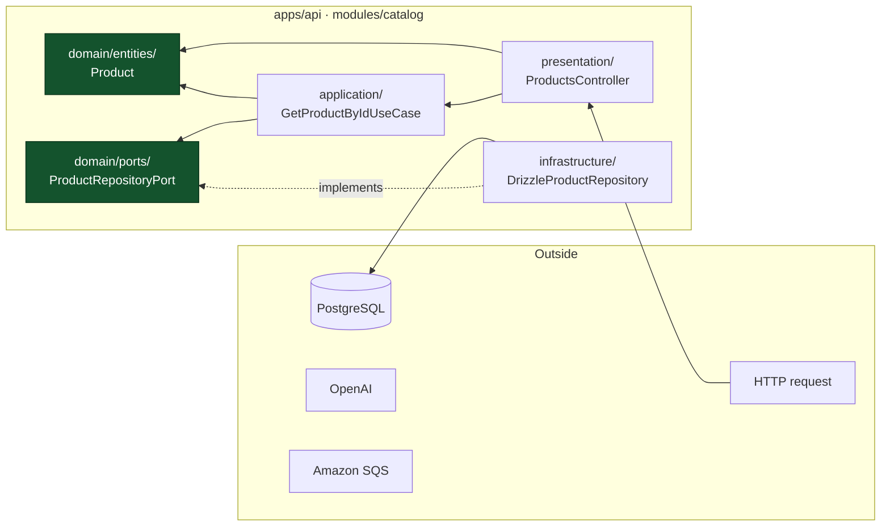

# Hexagonal architecture — the rules and their enforcement

The decision and its rationale are in [ADR-002](../adr/ADR-002-hexagonal-architecture.md).
This document is the working reference.

## The one rule

```
EXTERNAL SYSTEM  →  ADAPTER  →  PORT  →  APPLICATION  →  DOMAIN
```

Dependencies point inwards. Never outwards. Everything else follows from this.



## What may live where

| Layer             | May import                                                        | Must never import                                                      |
| ----------------- | ----------------------------------------------------------------- | ---------------------------------------------------------------------- |
| `domain/`         | `@cdr/shared` primitives, other domain code                       | Any framework, driver or vendor SDK; any outer layer                   |
| `application/`    | domain, ports, `@nestjs/common` (DI only), `@cdr/messaging` ports | Drizzle, `postgres`, `openai`, `@aws-sdk`, any adapter, any controller |
| `infrastructure/` | anything                                                          | —                                                                      |
| `presentation/`   | application, domain, `@cdr/contracts`                             | Adapters directly                                                      |

`@nestjs/common` is permitted in `application/` for `@Injectable` and `@Inject`. That is a
deliberate, bounded concession: a use case names the _port_ it needs, never its adapter, and
avoiding it entirely would mean a hand-rolled container for no practical gain.

## How the rules are enforced

**ESLint** (`packages/eslint-config/hexagonal.mjs`) gives fast feedback in the editor via
`no-restricted-imports` patterns on `**/modules/*/domain/**` and `**/modules/*/application/**`.

**The architecture test** (`apps/api/test/architecture/boundaries.spec.ts`) is the authority.
It statically scans every file and asserts:

- no framework, driver or vendor SDK in `domain/`;
- no outer-layer import in `domain/`;
- no concrete driver in `application/`;
- no adapter or controller import in `application/`;
- no cross-module reach-in past the published surface;
- no `process.env` read outside the configuration provider and the standalone CLIs;
- no `openai` import outside `modules/ai/infrastructure/openai/`.

It runs in `pnpm test`, so a violation fails CI with the file and the import named.

> If one of these fails, the fix is almost never to relax the rule — it is to introduce a
> port. Treat any change to that spec file as an architectural change requiring review.

## Naming ports

Name the **capability**, not the technology.

| Good                     | Bad                  | Why                                      |
| ------------------------ | -------------------- | ---------------------------------------- |
| `ProductVectorIndexPort` | `PgVectorRepository` | Survives moving the index to OpenSearch  |
| `ErpProductSourcePort`   | `DynamicsAxClient`   | Survives replacing AX — the entire point |
| `ObjectStoragePort`      | `S3Service`          | Survives a storage change                |
| `EmbeddingProviderPort`  | `OpenAiClient`       | Survives a provider change               |

## Worked example — the walking skeleton

`GET /api/v1/products/:id`

| Step | File                                                       | Layer                                                                              |
| ---- | ---------------------------------------------------------- | ---------------------------------------------------------------------------------- |
| 1    | `presentation/products.controller.ts`                      | Validates the path parameter, calls the use case, maps to DTO                      |
| 2    | `application/get-product-by-id.use-case.ts`                | Validates the UUID, calls `ProductRepositoryPort.findById`, throws `NotFoundError` |
| 3    | `domain/ports/product-repository.port.ts`                  | The interface — no implementation                                                  |
| 4    | `infrastructure/persistence/drizzle-product.repository.ts` | Executes SQL, maps rows to `Product`                                               |
| 5    | `domain/entities/product.ts`                               | The aggregate: no decorators, no ORM, no HTTP                                      |
| 6    | `catalog.module.ts`                                        | The single line binding the port to the adapter                                    |

Step 2 is unit-tested with `InMemoryProductRepository` — no database, milliseconds.
Step 4 is integration-tested against real PostgreSQL, because that is where the behaviour
under test (upserts, cascades, unique indexes) actually lives.
