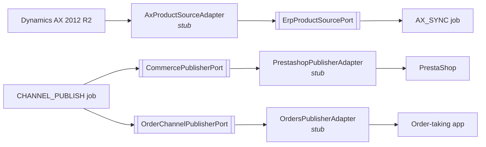

# Integration architecture

## The shape of every integration

```
EXTERNAL SYSTEM  →  ADAPTER  →  PORT  →  APPLICATION  →  DOMAIN
```

No exceptions. This is what makes "replace AX without rebuilding the PIM" a one-adapter
change rather than a project.



## Status — and what is blocking each one

| Integration      | Port                           | Adapter                                                    | Blocked on                                           |
| ---------------- | ------------------------------ | ---------------------------------------------------------- | ---------------------------------------------------- |
| Dynamics AX      | `ErpProductSourcePort` ✅      | Stub that throws; `InMemoryErpProductSource` bound instead | Integration surface, entity mapping, VPN             |
| PrestaShop       | `CommercePublisherPort` ✅     | Stub that throws                                           | Version, API access, field mapping, network location |
| Order-taking app | `OrderChannelPublisherPort` ✅ | Stub that throws                                           | Which system it is, and whether it has an API        |
| OpenAI           | 3 ports ✅                     | Implemented + deterministic fakes                          | Nothing — an API key switches it on                  |
| S3               | `ObjectStoragePort` ✅         | Implemented (`S3StorageAdapter`) + in-memory               | Nothing                                              |
| SQS              | `QueuePort` ✅                 | Implemented (`SqsQueueAdapter`) + in-memory                | Nothing                                              |

The three stubs **throw a documented `DependencyUnavailableError`** rather than returning
empty results. Silence would be worse: an adapter that quietly returns nothing looks like
"the ERP has no changes" and hides a missing integration for weeks.

## What Casa del Rulimán must decide or provide

None of this is invented. Each item blocks a specific piece of work.

### Dynamics AX 2012 R2

1. **Integration surface** — AIF services? A staging/replication database? A scheduled
   export? Each implies a different adapter and a different failure mode.
2. **Authentication** — service account, domain, permissions.
3. **Entity mapping** — which AX entities and fields correspond to SKU, name, description,
   brand and manufacturer part number.
4. **Delta field** — the field that reliably marks "modified since". Without a trustworthy
   one, every synchronisation is a full scan.
5. **Volume and cadence** — how many items change per day; how fresh the PIM must be.
6. **Direction** — confirmation that the PIM never writes back to AX.

### PrestaShop

1. Version, and whether the Webservice API is enabled.
2. API key and base URL.
3. Field mapping onto PrestaShop's product/attribute/category model.
4. Network location — internal (VPN) or internet-reachable.
5. Behaviour when a product is unpublished in the PIM.

### Order-taking application

1. Which system it is.
2. Whether it exposes an API or expects a file drop.
3. Its product model, and whether it can represent equivalences.

## The job envelope

Every asynchronous message shares one validated shape (`@cdr/contracts`):

```jsonc
{
  "schemaVersion": 1,
  "jobId": "uuid",
  "type": "AX_SYNC | AI_EMBEDDING | DOCUMENT_EXTRACTION | IMPORT_BATCH | CHANNEL_PUBLISH",
  "correlationId": "follows one unit of work end to end",
  "idempotencyKey": "business identity — makes redelivery safe",
  "occurredAt": "2026-08-30T12:00:00.000Z",
  "source": "api | eventbridge:ax-delta-sync",
  "payload": {},
}
```

`buildJobEnvelope` is the only constructor, so no producer can omit the correlation id or
the idempotency key. `schemaVersion` lets a worker reject a payload it cannot understand
instead of misinterpreting it.

## Idempotency

SQS delivers **at least once**. Every handler must be able to process the same
`idempotencyKey` twice and reach the same end state.

The key is derived from business identity, not from the request:

- `ai-embedding:{productId}` — two saves seconds apart converge on one unit of work;
- `ax-sync:{erpItemId}:{modifiedAt}` — re-running a sync window is free;
- `import-batch:{fileChecksum}` — uploading the same file twice imports it once.

Where the operation is not naturally idempotent, the handler records processed keys itself.

## Failure policy

| Situation                                                             | Action                                                                                |
| --------------------------------------------------------------------- | ------------------------------------------------------------------------------------- |
| Handler succeeds                                                      | Acknowledge (delete)                                                                  |
| `PermanentJobError` (malformed payload, entity that will never exist) | Acknowledge, log with full context. Retrying cannot help and would hide real failures |
| Transient failure                                                     | Release with exponential backoff; SQS redelivers                                      |
| Attempts exhausted                                                    | Leave the message alone. The queue's redrive policy moves it to the DLQ               |
| Unknown job type                                                      | Leave the message alone. Almost always a producer deployed ahead of its consumer      |

**The worker never moves a message to the DLQ itself.** One authority for that decision, and
it is the `maxReceiveCount` in Terraform.

## Explicitly out of scope

TecDoc, specific manufacturer APIs, and any additional channel. Adding one means writing an
adapter behind an existing or new port — not changing the architecture.
