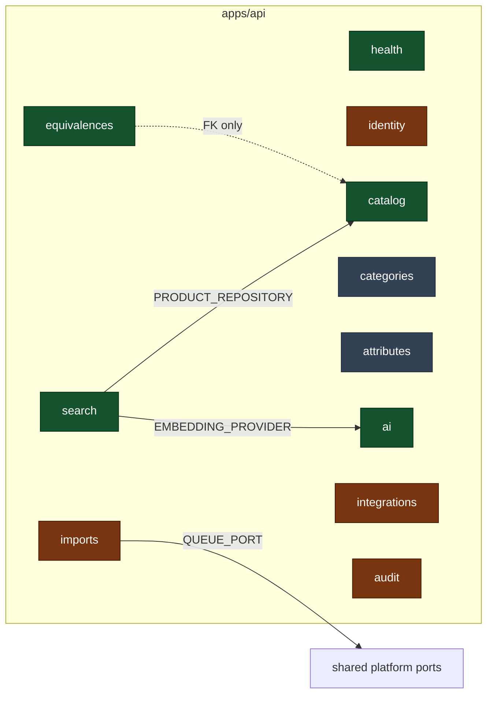

# C4 Level 3 — Bounded contexts



## Status of each context

Colour-coded above; stated plainly here. **"Scaffolding" means domain types exist and
nothing is persisted** — not that something is half-broken.

| Context          | Status                      | What exists                                                                                                                                                           | What is deliberately missing, and why                                                               |
| ---------------- | --------------------------- | --------------------------------------------------------------------------------------------------------------------------------------------------------------------- | --------------------------------------------------------------------------------------------------- |
| **health**       | Complete                    | Liveness, readiness, indicator port, PostgreSQL indicator                                                                                                             | —                                                                                                   |
| **catalog**      | Walking skeleton            | `Product`, `ProductIdentifier`, repository port, Drizzle adapter, 3 use cases, REST controller, tables                                                                | Images/documents/data-quality persistence — needs CDR's asset and quality rules                     |
| **equivalences** | Aggregate + persistence     | `EquivalenceGroup` aggregate, repository port, Drizzle adapter, tables, integration tests                                                                             | Use cases and endpoints — how groups get _created_ (import? curation? AI?) is a CDR decision        |
| **search**       | Working end to end          | Vector index port, pgvector adapter, indexing and semantic-search use cases, controller                                                                               | Hybrid attribute+vector ranking; needs the attribute model first                                    |
| **ai**           | Complete for the foundation | Three provider ports, OpenAI adapters, deterministic fakes, config-driven selection                                                                                   | Token budgets and rate limiting — see KNOWN GAPS                                                    |
| **identity**     | Foundation                  | Role model, token port, JWT adapter, `JwtAuthGuard`, `RolesGuard`, decorators                                                                                         | User store, login/refresh endpoints, revocation. **Guards are not registered globally** — see below |
| **imports**      | Job producers only          | Two use cases publishing to the queue, controller                                                                                                                     | File parsing, staging, validation reports — import rules not yet defined                            |
| **integrations** | Ports + honest stubs        | `ErpProductSourcePort`, `CommercePublisherPort`, `OrderChannelPublisherPort`; in-memory ERP source; AX/PrestaShop/orders adapters that throw with a documented reason | Real adapters — blocked on VPN, credentials and field mappings from CDR                             |
| **audit**        | Port + interim adapter      | `AuditEntry`, `AuditPort`, logging adapter (CloudWatch-queryable)                                                                                                     | `audit_entries` table — retention and reporting requirements not defined                            |
| **categories**   | Scaffolding                 | `Category`, `CategoryAttributeTemplate` domain types                                                                                                                  | No table, no repository. The taxonomy is a CDR deliverable                                          |
| **attributes**   | Scaffolding                 | `AttributeDefinition`, `ProductAttribute`, validation helpers                                                                                                         | No table, no repository. The attribute dictionary is a CDR deliverable                              |

`categories` and `attributes` have **no Nest module**: a module registering nothing would be
noise. They gain one when they gain persistence.

### Authentication is implemented but not switched on

`JwtAuthGuard` and `RolesGuard` are written and unit-tested, but not registered as
`APP_GUARD` in `AppModule`. There is no user store and no login endpoint yet, so enabling
them globally would lock every route with no way to obtain a token. The two-line change and
its prerequisites are documented in `AppModule` and in `SECURITY_BASELINE.md`.

## The rules that keep this a modular monolith

1. **A context's public surface is exactly**: the types in its `domain/ports/`, the types in
   its `domain/entities/`, and whatever its `*.module.ts` exports. Nothing else.
2. **No cross-module database access.** `search` needs products, so it injects
   `PRODUCT_REPOSITORY` — the port `CatalogModule` exports. It never queries `products`.
3. **No cross-module `application/`, `infrastructure/` or `presentation/` imports.**
4. **Foreign keys are allowed** between modules' tables: a database constraint is a physical
   guarantee, not a code dependency. `equivalence_group_members` references `products(id)`.
5. Rules 1–4 are enforced by `apps/api/test/architecture/boundaries.spec.ts`, which fails
   the build with the offending file and import named.

## Adding a new bounded context

```
apps/api/src/modules/<name>/
├── domain/
│   ├── entities/          # framework-free aggregates and value objects
│   └── ports/             # interfaces + their DI tokens
├── application/           # use cases, one per operation
├── infrastructure/        # adapters implementing the ports
│   └── persistence/       # <name>.tables.ts if it owns tables
├── presentation/          # controllers, DTO mapping
└── <name>.module.ts       # binds ports to adapters; exports the public surface
```

Then register the tables in `src/database/schema/index.ts` and the module in `AppModule`.
The architecture test picks the new context up automatically.
