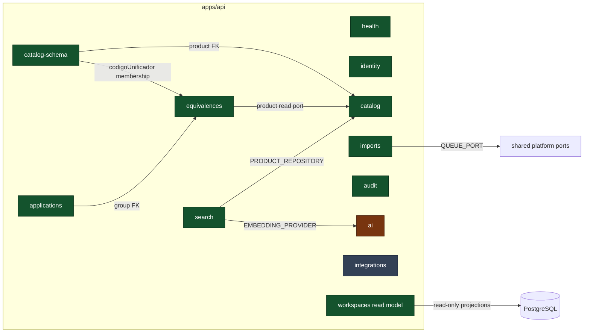

# C4 Level 3 — Bounded contexts



## Estado de cada contexto

| Contexto           | Estado                     | Implementado                                                                                                                                                           | Pendiente real                                                                                         |
| ------------------ | -------------------------- | ---------------------------------------------------------------------------------------------------------------------------------------------------------------------- | ------------------------------------------------------------------------------------------------------ |
| **health**         | Operativo                  | Liveness, readiness y verificación de PostgreSQL                                                                                                                       | —                                                                                                      |
| **identity**       | Operativo para local/test  | Login local, JWT, roles `ADMINISTRADOR`/`COMPRAS`/`VENTAS`, capacidades explícitas, guardas globales y aliases temporales                                              | Proveedor empresarial, refresco y revocación; dependen de la decisión de identidad de CDR              |
| **catalog**        | Operativo, alcance base    | Producto, identificadores, listado, detalle, creación, repositorio PostgreSQL y auditoría de creación                                                                  | Reglas finales de calidad                                                                              |
| **catalog-schema** | Operativo                  | Categorías; plantillas versionadas; valores tipados; tabla dinámica; filtros; ficha técnica; edición optimista; herencia replicable; administración y permisos por rol | Crear versiones desde HTTP, diccionario definitivo y diseño comercial final de la ficha                |
| **applications**   | Operativo                  | Aplicaciones por código unificador; CRUD manual, tabla Excel, validación y carga masiva parcial con auditoría                                                          | Nombres y catálogos definitivos de los campos de aplicación                                            |
| **equivalences**   | Operativo                  | Grupos, membresías, homólogos y OEM; CRUD/carga masiva; búsqueda limitada a relaciones activas y aprobadas                                                             | Flujo de creación/curación de grupos desde la interfaz y reglas finales de aprobación                  |
| **imports**        | Operativo                  | CSV/XLSX/JSON desde la web; validación por fila, idempotencia, claim/lease y confirmación parcial transaccional para categorías, aplicaciones, homólogos y OEM         | Ejecución asíncrona para archivos que excedan los límites síncronos acordados                          |
| **audit**          | Operativo y consultable    | Eventos append-only, detalle por campo, filtros por SKU/campo/actor/origen/fecha y vigencia anterior; unidad de trabajo atómica para atributos dinámicos               | Política de retención/archivo y migrar escrituras antiguas que aún auditan en una transacción separada |
| **search**         | Operativo                  | Búsqueda directa, atributos, pgvector, homólogos/OEM elegibles e interpretación de afijos, combinados y deduplicados en la experiencia web                             | Worker de reindexación completa y ranking híbrido único en backend                                     |
| **ai**             | Fundación implementada     | Puertos, adaptadores OpenAI, fakes deterministas y selección por configuración                                                                                         | Presupuestos, cuotas distribuidas y flujos de revisión humana completos                                |
| **integrations**   | Puertos y stubs explícitos | Contratos para ERP, comercio y pedidos; fuente ERP en memoria para desarrollo                                                                                          | AX, PrestaShop y pedidos reales: VPN, credenciales y mapeos siguen pendientes                          |
| **product-assets** | Operativo                  | Metadatos por SKU, binarios privados en memoria/S3, carga individual y ZIP parcial, descarga, reemplazo/borrado lógico y auditoría atómica                             | Antimalware, lifecycle/reconciliación de objetos huérfanos y configuración S3 de cada ambiente         |
| **workspaces**     | Read model operativo       | Proyecciones protegidas para las pantallas no especializadas; declara acciones soportadas o bloqueadas                                                                 | Debe ceder comandos a los contextos propietarios; no sustituye sus endpoints                           |

`categories` y `attributes` conservan algunos tipos históricos, pero la implementación
persistida y expuesta por HTTP vive en `catalog-schema`. No deben tratarse como módulos
activos separados.

## Catálogo dinámico y permisos

`catalog-schema` publica dos superficies:

- consulta: categorías visibles, esquema del grid, filas filtrables y hoja técnica de un
  producto;
- administración: categorías y versiones de plantilla, asignaciones activas/inactivas,
  obligatoriedad, replicabilidad, búsqueda, orden, inclusión futura en ficha técnica y
  matriz `canView/canEdit/canImport/canExport` por rol.

Desactivar una asignación nunca borra su definición ni los valores ya capturados. Los
endpoints humanos de atributos aceptan únicamente valores de autoridad `pim`, fuerzan
origen `manual` y confirman valor + historial en una sola transacción. Los atributos
replicables se propagan a los productos elegibles del mismo código unificador.

## Autenticación privada por defecto

`JwtAuthGuard` y `RolesGuard` son guardas globales. Login local y health son las únicas
rutas públicas. El adaptador local toma una cuenta de variables validadas;
`AUTH_MODE=local` se rechaza en PRD y en QAS requiere el opt-in explícito y temporal
`ALLOW_LOCAL_AUTH_IN_QAS=true`. La autorización nueva usa capacidades; la matriz de
plantilla añade una segunda autorización server-side a nivel de atributo. Ocultar un
control en la web nunca reemplaza estas verificaciones. `SECURITY_BASELINE.md` documenta
el límite fail-closed y la decisión pendiente sobre el proveedor de identidad.

## Reglas del monolito modular

1. La superficie pública de un contexto son sus entidades, puertos y exports del módulo.
2. Los comandos y decisiones de dominio cruzan contextos mediante puertos, no mediante SQL.
3. `workspaces` es la excepción de lectura: proyecta varias tablas, pero no ejecuta comandos.
4. Las claves foráneas entre contextos son garantías físicas permitidas.
5. Una mutación y su auditoría deben compartir transacción cuando la consistencia lo exige;
   el patrón está documentado en `AUDIT_UNIT_OF_WORK.md`.
6. `apps/api/test/architecture/boundaries.spec.ts` protege los límites de capas y módulos.

## Estructura de un contexto

```text
apps/api/src/modules/<name>/
├── domain/
│   ├── entities/
│   └── ports/
├── application/
├── infrastructure/
│   └── persistence/
├── presentation/
└── <name>.module.ts
```

Las tablas se ensamblan en `src/database/schema/index.ts` y el módulo en `AppModule`; las
migraciones SQL siguen siendo la fuente autoritativa del esquema.
