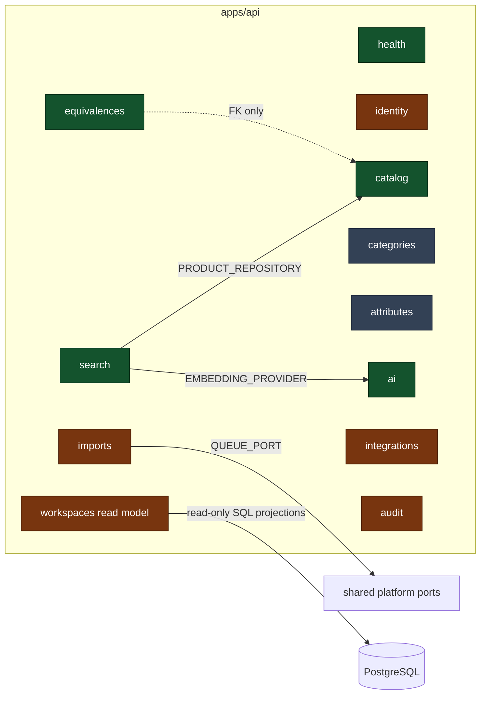

# C4 Level 3 — Bounded contexts



## Status of each context

Colour-coded above; stated plainly here. **"Scaffolding" means domain types exist and
nothing is persisted** — not that something is half-broken.

| Context          | Status                      | What exists                                                                                                                                                           | What is deliberately missing, and why                                                        |
| ---------------- | --------------------------- | --------------------------------------------------------------------------------------------------------------------------------------------------------------------- | -------------------------------------------------------------------------------------------- |
| **health**       | Complete                    | Liveness, readiness, indicator port, PostgreSQL indicator                                                                                                             | —                                                                                            |
| **catalog**      | Walking skeleton            | `Product`, `ProductIdentifier`, repository port, Drizzle adapter, 3 use cases, REST controller, tables                                                                | Images/documents/data-quality persistence — needs CDR's asset and quality rules              |
| **equivalences** | Aggregate + persistence     | `EquivalenceGroup` aggregate, repository port, Drizzle adapter, tables, integration tests                                                                             | Use cases and endpoints — how groups get _created_ (import? curation? AI?) is a CDR decision |
| **search**       | Working end to end          | Vector index port, pgvector adapter, indexing and semantic-search use cases, controller                                                                               | Hybrid attribute+vector ranking; needs the attribute model first                             |
| **ai**           | Complete for the foundation | Three provider ports, OpenAI adapters, deterministic fakes, config-driven selection, HTTP actor throttling                                                            | Cost/token budgets and distributed worker quotas                                             |
| **identity**     | Local authentication        | Role and credential ports, env adapter, login/me endpoints, issuer/audience-bound JWTs, global auth/RBAC guards, brute-force throttling                               | Enterprise user source, refresh and revocation — pending CDR's identity-provider decision    |
| **imports**      | Job producers only          | Two use cases publishing to the queue, controller                                                                                                                     | File parsing, staging, validation reports — import rules not yet defined                     |
| **integrations** | Ports + honest stubs        | `ErpProductSourcePort`, `CommercePublisherPort`, `OrderChannelPublisherPort`; in-memory ERP source; AX/PrestaShop/orders adapters that throw with a documented reason | Real adapters — blocked on VPN, credentials and field mappings from CDR                      |
| **audit**        | Durable append-only trail   | `AuditEntry`, `AuditPort`, PostgreSQL adapter/table, immutable DML/DDL triggers; product creation connected                                                           | Retention, archival/reporting policy and coverage for future write use cases                 |
| **categories**   | Scaffolding                 | `Category`, `CategoryAttributeTemplate` domain types                                                                                                                  | No table, no repository. The taxonomy is a CDR deliverable                                   |
| **attributes**   | Scaffolding                 | `AttributeDefinition`, `ProductAttribute`, validation helpers                                                                                                         | No table, no repository. The attribute dictionary is a CDR deliverable                       |
| **workspaces**   | Live read model             | Protected `GET /api/v1/workspaces/:slug`, shared Zod contract and PostgreSQL/configuration projections for the eleven non-product screens                             | Write actions stay blocked until each owning context has confirmed rules and persistence     |

`categories` and `attributes` have **no Nest module**: a module registering nothing would be
noise. They gain one when they gain persistence.

### Authentication is enabled and private by default

`JwtAuthGuard` and `RolesGuard` are global `APP_GUARD` providers. Health and local login are
the only routes marked public. The development credential adapter reads one account from
validated environment variables and `AUTH_MODE=local` is rejected in QAS/PRD. See
`SECURITY_BASELINE.md` for the fail-closed boundary and pending identity-provider decision.

## The rules that keep this a modular monolith

1. **A context's public surface is exactly**: the types in its `domain/ports/`, the types in
   its `domain/entities/`, and whatever its `*.module.ts` exports. Nothing else.
2. **No cross-module database access for commands or domain behavior.** `search` needs products, so it injects
   `PRODUCT_REPOSITORY` — the port `CatalogModule` exports. It never queries `products`.
   The one explicit exception is the `workspaces` query adapter: it builds read-only,
   cross-context reporting projections directly from stable PostgreSQL tables. It cannot
   write, expose a command or decide business eligibility; each owning context remains the
   only future path for mutations.
3. **No cross-module `application/`, `infrastructure/` or `presentation/` imports.**
4. **Foreign keys are allowed** between modules' tables: a database constraint is a physical
   guarantee, not a code dependency. `equivalence_group_members` references `products(id)`.
5. Rules 1–5 are enforced by `apps/api/test/architecture/boundaries.spec.ts`, which fails
   the build with the offending file and import named.

## Adding a new bounded context

```
apps/api/src/modules/<name>/
├── domain/
│   ├── entities/          # framework-free aggregates and value objects
│   └── ports/             # interfaces + their DI tokens
├── application/           # use cases, one per operation
├── infrastructure/        # adapters implementing the ports
│   └── persistence/       # <name>.tables.ts if it owns tables
├── presentation/          # controllers, DTO mapping
└── <name>.module.ts       # binds ports to adapters; exports the public surface
```

Then register the tables in `src/database/schema/index.ts` and the module in `AppModule`.
The architecture test picks the new context up automatically.
