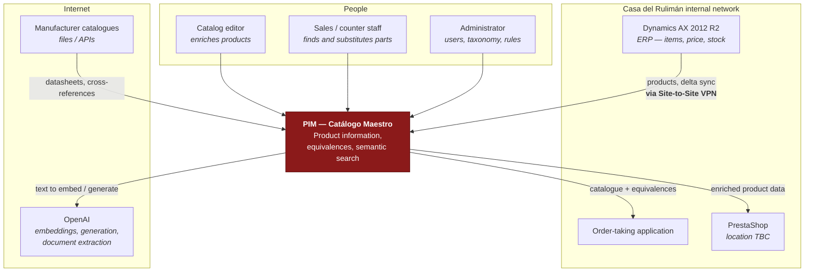

# C4 Level 1 — System context

## The system in one paragraph

The PIM is Casa del Rulimán's **system of record for product information**. It is not an
ERP, not a shop and not a stock system. Dynamics AX remains authoritative for items, prices
and inventory; the PIM owns descriptions, technical attributes, taxonomy, imagery,
documentation, equivalences and data quality — and publishes that enriched information to
whichever channels need it.

That split is the whole design. It is what allows AX to be replaced one day without
rebuilding the catalogue, and what prevents the PIM from becoming a second, competing source
of truth for commercial data.

## Actors

| Actor                     | Uses the PIM to                                                                                                            |
| ------------------------- | -------------------------------------------------------------------------------------------------------------------------- |
| **Catalog editor**        | Enrich products: descriptions, attributes, images, datasheets; review AI-generated or extracted content before publication |
| **Sales / counter staff** | Find a part from a vague description, and find what interchanges with it when it is out of stock                           |
| **Administrator**         | Manage users and roles, taxonomy, attribute dictionary and publication rules                                               |

## External systems

| System                       | Direction        | Status                                                                                                                    |
| ---------------------------- | ---------------- | ------------------------------------------------------------------------------------------------------------------------- |
| **Dynamics AX 2012 R2**      | AX → PIM         | Port defined (`ErpProductSourcePort`); adapter is a documented stub. Needs VPN and integration-surface decisions from CDR |
| **PrestaShop**               | PIM → PrestaShop | Port defined (`CommercePublisherPort`); adapter stubbed. Needs API access and field mapping                               |
| **Order-taking application** | PIM → orders     | Port defined (`OrderChannelPublisherPort`); adapter stubbed. Target system not yet specified                              |
| **OpenAI**                   | PIM → OpenAI     | Adapters implemented. Runs against deterministic fakes until a key is configured                                          |
| **Manufacturer catalogues**  | → PIM            | Out of scope for the foundation. TecDoc and specific manufacturers are explicitly excluded                                |

## What the PIM deliberately does **not** do

- It does not hold price or stock. Those stay in AX.
- It does not take orders.
- It does not write back to AX. The integration is one-directional by design; making it
  bidirectional would recreate the coupling the project exists to avoid.
